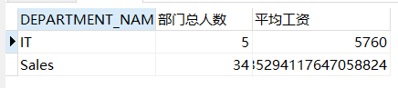
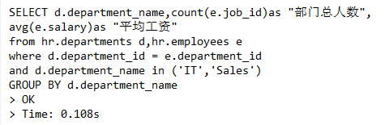
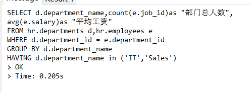
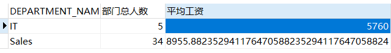

# 实验1：SQL语句的执行计划分析与优化指导
## 实验目的
```text
分析SQL执行计划，执行SQL语句的优化指导。理解分析SQL语句的执行计划的重要作用。
```
## 实验内容
### 1. 运行和分析下面两个语句并分析判断哪个语句更优。
#### 1) 语句1
* 代码
```SQL
set autotrace on

SELECT d.department_name,count(e.job_id)as "部门总人数",
avg(e.salary)as "平均工资"
from hr.departments d,hr.employees e
where d.department_id = e.department_id
and d.department_name in ('IT','Sales')
GROUP BY d.department_name;
```
* 截图  

#### 2) 语句2:
* 代码：
```SQL
set autotrace on

SELECT d.department_name,count(e.job_id)as "部门总人数",
avg(e.salary)as "平均工资"
FROM hr.departments d,hr.employees e
WHERE d.department_id = e.department_id
GROUP BY d.department_name
HAVING d.department_name in ('IT','Sales');
```
* 截图：  

#### 3)分析和判断
* 语句1运行消耗时长  

* 语句2运行消耗时长  

```text
由图可知，语句1的运行消耗时长比语句2的运行消耗时长更短，说明语句1比语句2的效率更高
造成这种结果的原因是：
语句1是先筛选出符合条件的数据，再将数据进行分组；而语句2是先将数据进行分组，再去筛选出符合条件的语句。
这样一来，在执行分组操作时，语句1实际操作的数据比语句2的更少，因此花费的时间更少
```
### 2. 请设计自己的查询语句，并对其作出分析。
#### 1) 设计语句
* 代码：
```SQL
SELECT d.department_name,count(e.job_id)as "部门总人数",
avg(e.salary)as "平均工资"
from(
	select d.department_id,d.department_name
	from hr.departments d
	where d.department_name in ('IT','Sales')
	) d,hr.employees e
where d.department_id = e.department_id
GROUP BY d.department_name;
```
* 截图：   
  
#### 2) 分析语句
```text
该语句的设计原理是，先在 hr.departments表中找出department_name字段
满足('IT','Sales')中任意一个的数据组成一个新表，然后在将该新表
与hr.employees表通过department_id字段相连接，最后在连接后的表中
得出department_name,count(e.job_id)as "部门总人数",avg(e.salary)as "平均工资"字段的值。
一开始将字段满足某个条件的表组成新表，之后再与其他表进行其他操作，可以减少实际操作的数据量，
从而增加语句的运行效率。
```
