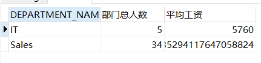

# 实验1：SQL语句的执行计划分析与优化指导
## 实验目的
```text
分析SQL执行计划，执行SQL语句的优化指导。理解分析SQL语句的执行计划的重要作用。
```
## 实验内容
### 1. 运行和分析下面两个语句并分析判断哪个语句更优。
  #### 1) 语句1
* 代码
```SQL
set autotrace on

SELECT d.department_name,count(e.job_id)as "部门总人数",
avg(e.salary)as "平均工资"
from hr.departments d,hr.employees e
where d.department_id = e.department_id
and d.department_name in ('IT','Sales')
GROUP BY d.department_name;
```
* 截图

#### 2) 语句2:
* 代码：
```SQL
set autotrace on

SELECT d.department_name,count(e.job_id)as "部门总人数",
avg(e.salary)as "平均工资"
FROM hr.departments d,hr.employees e
WHERE d.department_id = e.department_id
GROUP BY d.department_name
HAVING d.department_name in ('IT','Sales');
```
* 截图：
```image
```
#### (3)分析和判断
```text

```
