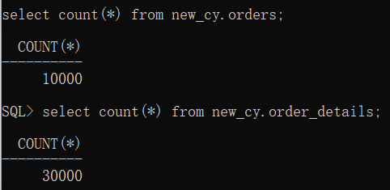
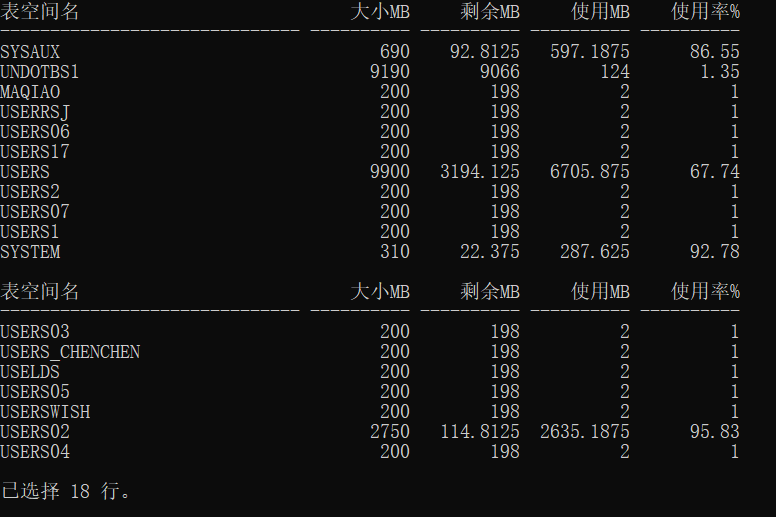

# 实验3：创建分区表
## 实验目的
```text
掌握分区表的创建方法，掌握各种分区方式的使用场景。
```
## 实验内容
* 本实验使用3个表空间：USERS,USERS02,USERS03。在表空间中创建两张表：订单表(orders)与订单详表(order_details)。
* 使用你自己的账号创建本实验的表，表创建在上述3个分区，自定义分区策略。
* 你需要使用system用户给你自己的账号分配上述分区的使用权限。你需要使用system用户给你的用户分配可以查询执行计划的权限。
* 表创建成功后，插入数据，数据能并平均分布到各个分区。每个表的数据都应该大于1万行，对表进行联合查询。
* 写出插入数据的语句和查询数据的语句，并分析语句的执行计划。
* 进行分区与不分区的对比实验。
## 实验步骤
### 1. 在主表orders和从表order_details之间建立引用分区  
#### 创建自己的账号：new_cy，然后以 system 身份登录:
```MYSQL
alter user new_cy quota unlimited on users;
alter user new_cy quota unlimited on users02;
alter user new_cy quota unlimited on users03;
```  
  
### 2. 用自己的账号new_cy登录,并创建表：orders（订单表）和order_details（订单详表）  
#### 创建表：orders（订单表）和order_details（订单详表）
* orders（订单表）
```MYSQL
sqlplus new_cy/123@localhost/pdborcl
CREATE TABLE orders 
(
 order_id NUMBER(10, 0) NOT NULL 
 , customer_name VARCHAR2(40 BYTE) NOT NULL 
 , customer_tel VARCHAR2(40 BYTE) NOT NULL 
 , order_date DATE NOT NULL 
 , employee_id NUMBER(6, 0) NOT NULL 
 , discount NUMBER(8, 2) DEFAULT 0 
 , trade_receivable NUMBER(8, 2) DEFAULT 0 
 , CONSTRAINT ORDERS_PK PRIMARY KEY 
  (
    ORDER_ID 
  )
) 
TABLESPACE USERS 
PCTFREE 10 INITRANS 1 
STORAGE (   BUFFER_POOL DEFAULT ) 
NOCOMPRESS NOPARALLEL 

PARTITION BY RANGE (order_date) 
(
 PARTITION PARTITION_BEFORE_2016 VALUES LESS THAN (
 TO_DATE(' 2016-01-01 00:00:00', 'SYYYY-MM-DD HH24:MI:SS', 
 'NLS_CALENDAR=GREGORIAN')) 
 NOLOGGING
 TABLESPACE USERS
 PCTFREE 10 
 INITRANS 1 
 STORAGE 
( 
 INITIAL 8388608 
 NEXT 1048576 
 MINEXTENTS 1 
 MAXEXTENTS UNLIMITED 
 BUFFER_POOL DEFAULT 
) 
NOCOMPRESS NO INMEMORY  
, PARTITION PARTITION_BEFORE_2020 VALUES LESS THAN (
TO_DATE(' 2020-01-01 00:00:00', 'SYYYY-MM-DD HH24:MI:SS', 
'NLS_CALENDAR=GREGORIAN')) 
NOLOGGING
TABLESPACE USERS
, PARTITION PARTITION_BEFORE_2021 VALUES LESS THAN (
TO_DATE(' 2021-01-01 00:00:00', 'SYYYY-MM-DD HH24:MI:SS', 
'NLS_CALENDAR=GREGORIAN')) 
NOLOGGING 
TABLESPACE USERS02
);
--以后再逐年增加新年份的分区
ALTER TABLE orders ADD PARTITION partition_before_2022
VALUES LESS THAN(TO_DATE('2022-01-01','YYYY-MM-DD'))
TABLESPACE USERS03;
```  

* order_details（订单详表）  
```MYSQL
CREATE TABLE order_details 
(
id NUMBER(10, 0) NOT NULL 
, order_id NUMBER(10, 0) NOT NULL
, product_id VARCHAR2(40 BYTE) NOT NULL 
, product_num NUMBER(8, 2) NOT NULL 
, product_price NUMBER(8, 2) NOT NULL 
, CONSTRAINT order_details_fk1 FOREIGN KEY  (order_id)
REFERENCES orders  (  order_id   )
ENABLE
) 
TABLESPACE USERS 
PCTFREE 10 INITRANS 1 
STORAGE ( BUFFER_POOL DEFAULT ) 
NOCOMPRESS NOPARALLEL
PARTITION BY REFERENCE (order_details_fk1);
```  
  
#### 插入数据，数据能并平均分布到各个分区
```MYSQL
for i in 1..10000
  loop
    if i mod 6 =0 then
      dt:=to_date('2015-3-2','yyyy-mm-dd')+(i mod 60); --PARTITION_2015
    elsif i mod 6 =1 then
      dt:=to_date('2016-3-2','yyyy-mm-dd')+(i mod 60); --PARTITION_2016
    elsif i mod 6 =2 then
      dt:=to_date('2017-3-2','yyyy-mm-dd')+(i mod 60); --PARTITION_2017
    elsif i mod 6 =3 then
      dt:=to_date('2018-3-2','yyyy-mm-dd')+(i mod 60); --PARTITION_2018
    elsif i mod 6 =4 then
      dt:=to_date('2019-3-2','yyyy-mm-dd')+(i mod 60); --PARTITION_2019
    else
      dt:=to_date('2020-3-2','yyyy-mm-dd')+(i mod 60); --PARTITION_2020
    end if;
    V_EMPLOYEE_ID:=CASE I MOD 6 WHEN 0 THEN 11 WHEN 1 THEN 111 WHEN 2 THEN 112
                                WHEN 3 THEN 12 WHEN 4 THEN 121 ELSE 122 END;
    --插入订单
    v_order_id:=i;
    v_name := 'aa'|| 'aa';
    v_name := 'zhang' || i;
    v_tel := '139888883' || i;
    insert /*+append*/ into ORDERS (ORDER_ID,CUSTOMER_NAME,CUSTOMER_TEL,ORDER_DATE,EMPLOYEE_ID,DISCOUNT)
      values (v_order_id,v_name,v_tel,dt,V_EMPLOYEE_ID,dbms_random.value(100,0));
    --插入订单y一个订单包括3个产品
    v:=dbms_random.value(10000,4000);
    v_name:='computer'|| (i mod 3 + 1);
    insert /*+append*/ into ORDER_DETAILS(ID,ORDER_ID,PRODUCT_NAME,PRODUCT_NUM,PRODUCT_PRICE)
      values (v_order_detail_id,v_order_id,v_name,2,v);
    v:=dbms_random.value(1000,50);
    v_name:='paper'|| (i mod 3 + 1);
    v_order_detail_id:=v_order_detail_id+1;
    insert /*+append*/ into ORDER_DETAILS(ID,ORDER_ID,PRODUCT_NAME,PRODUCT_NUM,PRODUCT_PRICE)
      values (v_order_detail_id,v_order_id,v_name,3,v);
    v:=dbms_random.value(9000,2000);
    v_name:='phone'|| (i mod 3 + 1);

    v_order_detail_id:=v_order_detail_id+1;
    insert /*+append*/ into ORDER_DETAILS(ID,ORDER_ID,PRODUCT_NAME,PRODUCT_NUM,PRODUCT_PRICE)
      values (v_order_detail_id,v_order_id,v_name,1,v);
    --在触发器关闭的情况下，需要手工计算每个订单的应收金额：
    select sum(PRODUCT_NUM*PRODUCT_PRICE) into m from ORDER_DETAILS where ORDER_ID=v_order_id;
    if m is null then
     m:=0;
    end if;
    UPDATE ORDERS SET TRADE_RECEIVABLE = m - discount WHERE ORDER_ID=v_order_id;
    IF I MOD 1000 =0 THEN
      commit; --每次提交会加快插入数据的速度
    END IF;
  end loop;
end;
```  

### 3. 求出orders（订单表）和order_details（订单详表）数据条数。
```MYSQL
select count(*) from new_cy.orders;
select count(*) from new_cy.order_details;
```  

### 4. 查看数据库的使用情况  
#### 查看表空间的数据库文件
```MYSQL
SELECT 
tablespace_name,FILE_NAME,BYTES/1024/1024 MB,MAXBYTES/1024/1024 MAX_MB,autoextensible FROM dba_data_files
WHERE  tablespace_name='USERS';
```

#### 查看每个文件的磁盘占用情况
```MYSQL
SELECT a.tablespace_name "表空间名",Total/1024/1024 "大小MB",
 free/1024/1024 "剩余MB",( total - free )/1024/1024 "使用MB",
 Round(( total - free )/ total,4)* 100 "使用率%"
 from (SELECT tablespace_name,Sum(bytes)free
        FROM   dba_free_space group  BY tablespace_name)a,
       (SELECT tablespace_name,Sum(bytes)total FROM dba_data_files
        group  BY tablespace_name)b
 where  a.tablespace_name = b.tablespace_name;
 ```  
 
 * autoextensible是显示表空间中的数据文件是否自动增加。
 * MAX_MB是指数据文件的最大容量。
